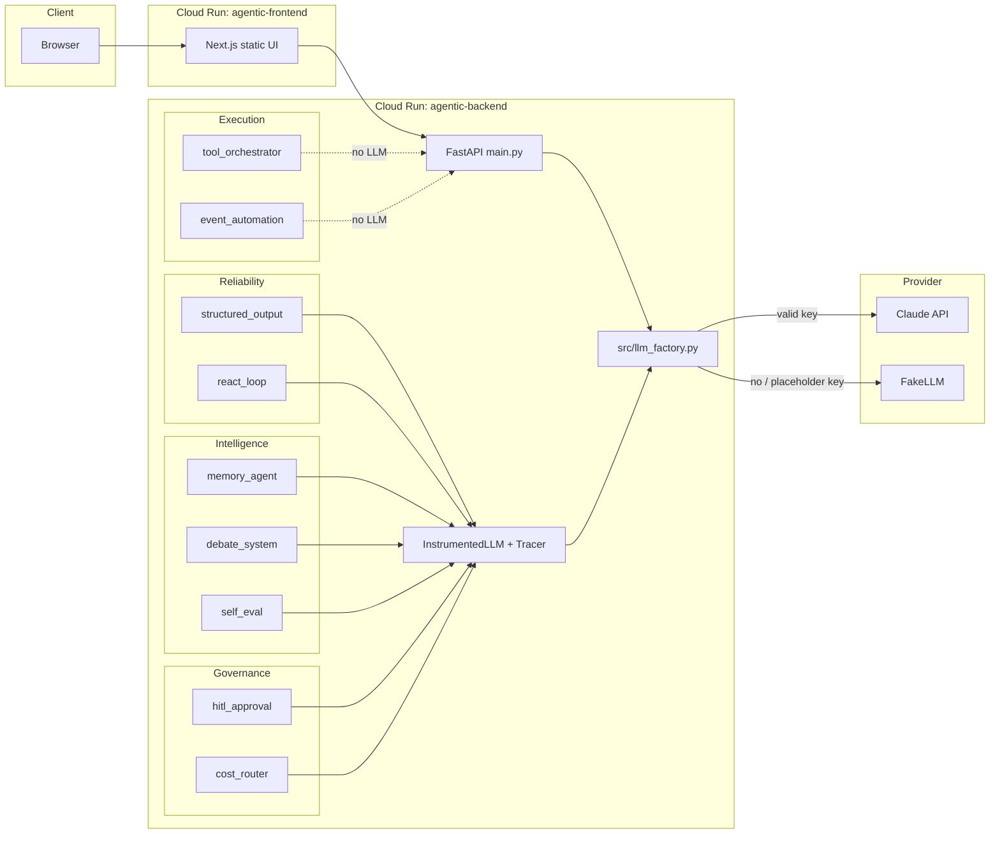

# Agentic

Ten Python agent modules behind a FastAPI API, a toolkit playground, and a composed agent UI.

Live (GCP project `agentic-509610`):

- Toolkit: https://agentic-frontend-luktzdc5wa-uc.a.run.app
- Agent: https://agentic-agent-luktzdc5wa-uc.a.run.app
- API: https://agentic-backend-luktzdc5wa-uc.a.run.app/docs

If `ANTHROPIC_API_KEY` is unset or a known placeholder, the API runs in **demo mode** (`FakeLLM`). If a key is present but rejected, playgrounds return HTTP 200 with `{ "status": "unavailable" }` instead of a raw 401.

## Architecture




Observability wraps every module that calls `complete()`. Orchestrator and event automation do not call the LLM.

## Modules

### Reliability

**Structured output** (`structured_output.py`) — schema-valid JSON with retries that feed the validation error back to the model.

```python
def extract(self, text: str) -> TModel:
    previous_error: str | None = None
    for attempt in range(self.max_retries + 1):
        raw = self.llm.complete(self.build_prompt(text, previous_error))
        try:
            return self.schema.model_validate_json(self._extract(raw))
        except (ValueError, ValidationError) as exc:
            previous_error = str(exc)
```

**ReAct** (`react_loop.py`) — bounded think-act-observe. Errors are observations; the loop never runs past `max_iterations`.

### Execution

**Tool orchestrator** (`tool_orchestrator.py`) — capability routing, priority, scopes, `execute_parallel` via `ThreadPoolExecutor`.

**Event automation** (`event_automation.py`) — idempotent `process`, bounded retries, dead-letter, `replay_dead_letter`.

### Intelligence

**Memory** (`memory_agent.py`) — short-term window, long-term recall by overlap score, LLM `compress`, save/load.

**Debate** (`debate_system.py`) — N proposers, critic scores, winner, aggregator.

**Self-eval** (`self_eval.py`) — worker → judge → refine; returns the best attempt.

### Governance

**HITL approval** (`hitl_approval.py`) — pause on low confidence or protected actions; `resume` with an audit trail.

**Cost router** (`cost_router.py`) — cheapest capable model, hard budget, at most one escalation, ledger analytics.

### Platform

**Observability** (`observability.py`) — `InstrumentedLLM` records cost, latency spans, and repeated-prompt loop alerts.

**LLM factory** (`src/llm_factory.py`) — `get_llm()` returns `(FakeLLM, "fake")` or `(RealLLM, "real")`. Invalid keys stay in real mode.

## Performance (measured on this machine)

These are wall-clock numbers from `/orchestrator/benchmark` running the real `wait` tool (`time.sleep`). They are **not** Cloud Run production SLOs.

| N | seconds/task | sequential_ms | parallel_ms | speedup |
|---|--------------|---------------|-------------|--------|
| 2 | 0.15 | 301.1 | 152.1 | 1.98× |
| 5 | 0.2 | 1001.7 | 202.9 | 4.94× |
| 5 | 0.2 (repeat) | 1001.3 | 203.2 | 4.93× |

No live Claude token latency was recorded here: the GCP secret was a placeholder at first deploy, and later local runs used demo mode.

## Local development

```powershell
cd C:\Users\RAMANATHAN.KR\Documents\Agentic
python -m pip install -r requirements.txt
copy .env.example .env
# Leave ANTHROPIC_API_KEY empty for demo mode, or set a real key for Claude.
python -m uvicorn main:app --host 127.0.0.1 --port 8000
```

```powershell
cd web
npm install
copy .env.example .env.local
npm run dev
```

- API: http://127.0.0.1:8000/docs
- UI: http://localhost:3000
- `pytest tests/`

Docker (needs Docker Desktop):

```powershell
docker compose up --build
```

## Deploy (GCP)

Project: `agentic-509610`. Region: `us-central1`. Key lives in Secret Manager (`anthropic-api-key`), not in git.

```powershell
gcloud config set project agentic-509610
gcloud builds submit --config cloudbuild.yaml --project agentic-509610
```

First-time APIs, Artifact Registry, IAM, and secret: `.\scripts\gcp_first_deploy.ps1` or `scripts/gcp_commands.sh`.

Store a real key (do not commit it):

```powershell
printf '%s' 'YOUR_KEY' | gcloud secrets versions add anthropic-api-key --data-file=- --project=agentic-509610
```

CI: Cloud Build trigger on `main` using `cloudbuild.yaml`.

## Known limitations

- Demo `FakeLLM` responses are scripted to match module contracts. They are not model quality.
- A present but invalid key does **not** fall back to FakeLLM; the UI shows an info banner.
- Frontend is a static Next export. The API URL is baked in at image build (`VITE_API_URL` → `NEXT_PUBLIC_API_URL`).
- Orchestrator parallel speedup is from sleeping demo tools, not from Claude.
- Cloud Run can cold-start; that was not measured in this README.
- `docker compose` was not verified on the Windows agent host (Docker was not installed).
- HITL, cost-router, debate, and self-eval expect JSON from the model; a live model that ignores the prompt can still fail parse paths that are not provider 401s.
- Process memory (approval tickets, event idempotency, cost ledger, tracer) is in-memory per Cloud Run instance and is lost on scale-to-zero.

## Repo layout

- Ten modules + `main.py` + `real_llm.py` at repo root (imported, not rewritten).
- `tests/fake_llm.py` — grading harness; do not edit.
- `src/llm_factory.py` — live vs demo client.
- `web/` — Next.js UI.
- `backend/Dockerfile`, `frontend/Dockerfile`, `docker-compose.yml`, `cloudbuild.yaml`.
